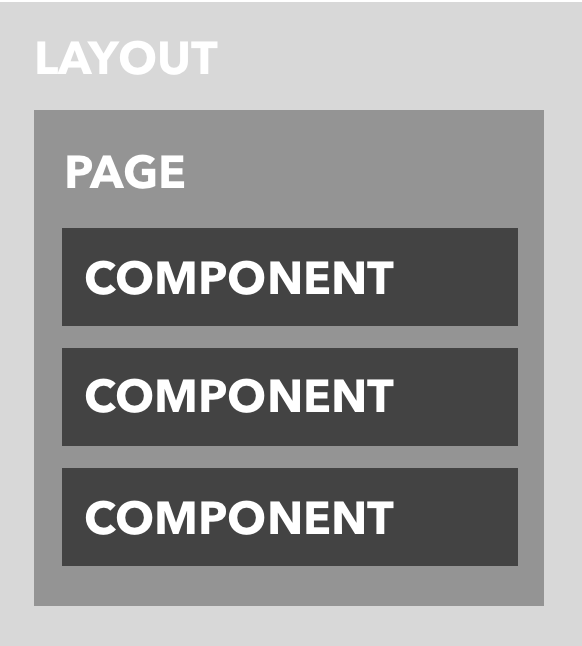

# example-storybook -- A Redwood-based set of Storybook examples

<span>
🌲✨📖 _A forest full of stories_ 📖✨🌲</span>
## Description

Example application written using Redwood that leverages Redwood's [Storybook integration](https://redwoodjs.com/docs/storybook.html#storybook) to highlight some of the concepts, such as the [Layout](https://learn.redwoodjs.com/docs/tutorial/layouts/), and [Cells](https://redwoodjs.com/docs/cells).



## Getting Started
### System Requirements

> RedwoodJS requires Node.js (>=14.x <=16.x) and Yarn (>=1.15).

Source: https://redwoodjs.com/docs/quick-start

### Developer Experience 

```sh
git clone https://github.com/redwoodjs/example-storybook.git `# clone the repository from GitHub` \
  && cd "$(basename "$_" .git)" `# change directories into the newly cloned repository` \
  && yarn install `# install dependencies` \
  && yarn redwood storybook `# start Redwood's storybook server`
```

_note:_ That should have brought up the browser automatically. If not, by default storybook is running at http://localhost:7910/
